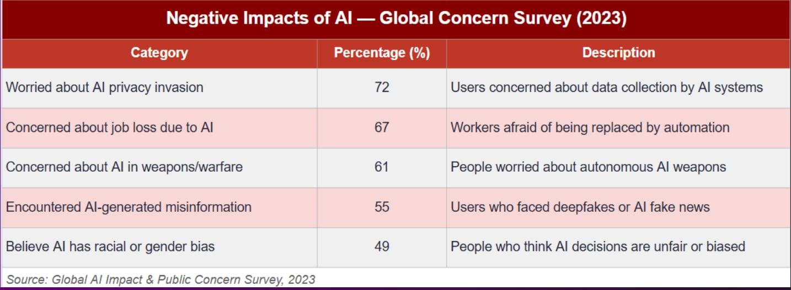
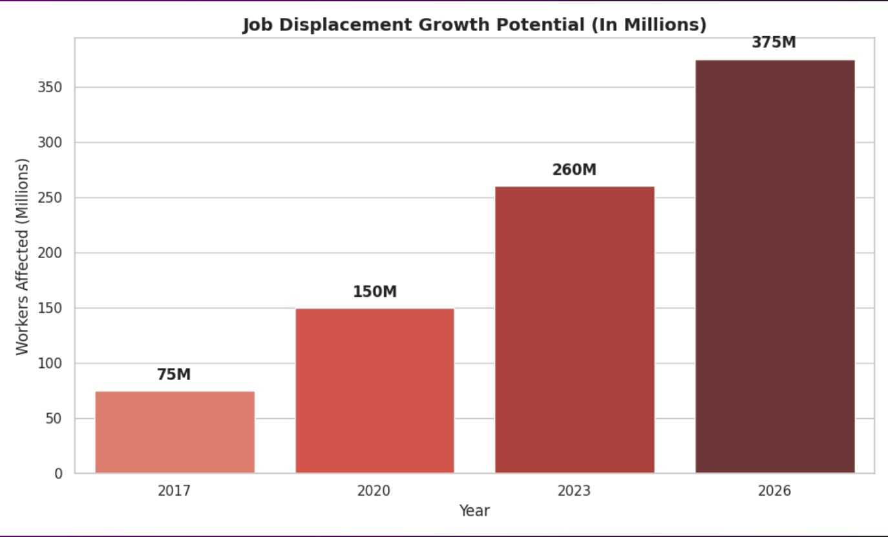

# 📚 SEU-CSE1102-GS1006

> **Course:** CSE1102 | **Group:** GS1006 | **Project Topic:** Negative Sides of AI

---

## 📖 Project Overview
This project examines the negative sides of Artificial Intelligence, including ethical concerns, job displacement, privacy issues, bias in AI systems, and potential risks to society. We analyzed real-world examples and provided recommendations to mitigate these challenges while using AI responsibly.

---

### 👨‍🏫 Instructor

| Name                | Role              | GitHub |
|---------------------|-------------------|--------|
| Tashreef Muhammad   | Course Instructor | [Tashreef Muhammad](https://github.com/TashreefMuhammad) |

---

## 👥 Group Members

| SL | Name                    | Student ID         |
|----|-------------------------|--------------------|
| 1  | Farzana Akter Meem      | 2026000000320      |
| 2  | Shamim Ahmed            | 2026000000277      |
| 3  | Mahbub Alam             | 2026000000272      |
| 4  | Jesmin Akter Jhuma      | 2026000000297      |

---

## 📁 Repository Structure

- **`/slides`** → Presentation slides (.pptx & .pdf)
- **`/report`** → Final project report (.pdf)
- **`/excel`** → Raw data and Excel analysis files
- **`/images`** → Charts, diagrams and screenshots
- **`README.md`** → Project documentation

---

## 🔄 Project Workflow

1. Topic selection and proposal approval
2. Research on negative impacts of AI
3. Data collection from reliable sources
4. Data analysis and visualization in Excel
5. Insight generation and recommendation development
6. Report writing and presentation slide preparation

---

## 📊 Key Visualizations

**1. Data Table / Statistics**

**2. Bar Chart - Negative Impacts**

**3. Diagram / Framework**

---

## 📊 Spreadsheet Explanation
The `/excel` folder contains datasets related to AI's negative impacts (job loss statistics, bias cases, privacy breach incidents, etc.). We used Excel for data cleaning, pivot tables, and creating charts showing trends and comparisons.

---

## 🤖 Use of AI Tools

- Grok AI: Helped with structuring the report, generating workflow, and improving README
- ChatGPT: Assisted in content research and grammar checking
- Microsoft Copilot: Supported in slide design and formatting

---

## 📈 Contribution of Each Member

| Member                  | Major Contributions                              |
|-------------------------|--------------------------------------------------|
| Farzana Akter Meem      | Data collection, Excel analysis, Charts         |
| Shamim Ahmed            | Research, Report writing                         |
| Mahbub Alam             | Content organization, Recommendations            |
| Jesmin Akter Jhuma      | Presentation slides, Overview & Editing
